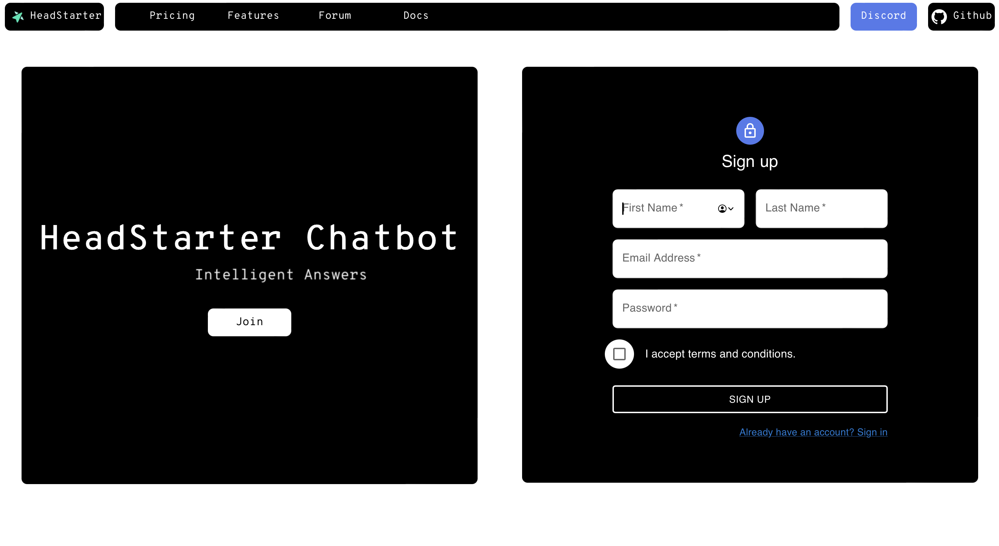
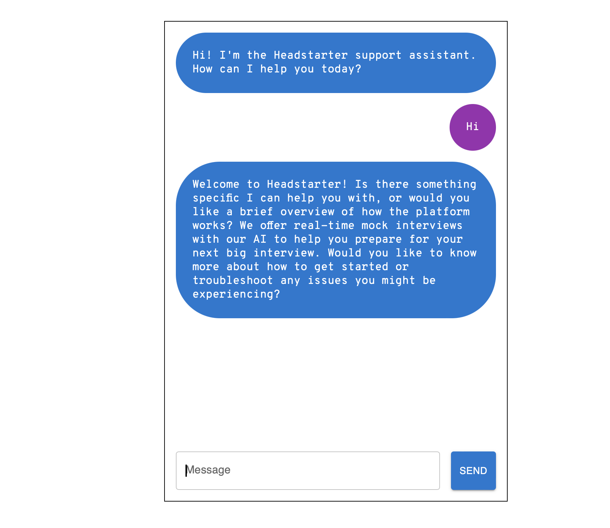
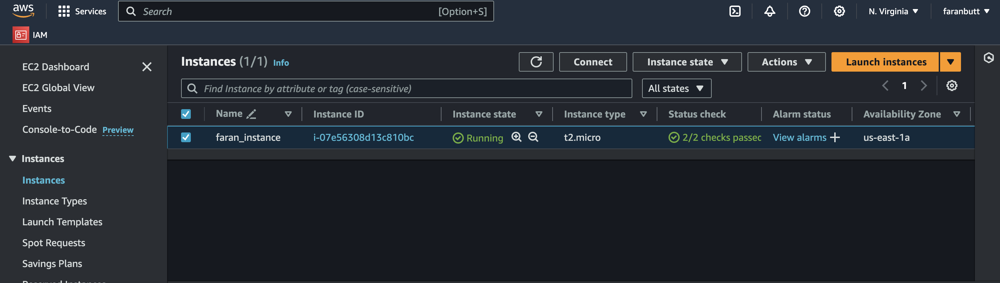

# 🤖 Headstarter AI Customer Support Chatbot

Welcome to the Headstarter AI Customer Support Chatbot! This project is designed to provide a seamless and intelligent customer support experience using the power of AI. The chatbot is built with Next.js, Firebase, OpenAI, Vercel, and LangChain.

## 🚀 Features

- **Real-time Chat Support**: Engage with users instantly and provide assistance in real-time.
- **AI-Powered Responses**: Utilize OpenAI to generate accurate and relevant responses to customer queries.
- **Scalable & Secure**: Hosted on Vercel with Firebase for secure and scalable backend services.
- **Easy Integration**: Plug and play integration with any Next.js application.
- **Customizable Workflows**: Use LangChain to define and customize the conversation flow and logic.

## 🛠️ Tech Stack

- **Frontend**: [Next.js](https://nextjs.org/)
- **Backend**: [Firebase](https://firebase.google.com/)
- **AI**: [Llama 3.1 8B](https://openrouter.ai/models/meta-llama/llama-3.1-8b-instruct:free)
- **Hosting**: [Vercel](https://vercel.com/)
- **Conversational Logic**: [LangChain](https://langchain.com/)

## Getting Started

First, run the development server:

```bash
npm run dev
# or
yarn dev
# or
pnpm dev
# or
bun dev
```

Open [http://localhost:3000](http://localhost:3000) with your browser to see the result.


## Live Project on EC2 Instance:

1. http://ec2-54-166-199-201.compute-1.amazonaws.com:3000/
2. http://ec2-54-166-199-201.compute-1.amazonaws.com:3000/chat

## Demo:
<a href="https://www.youtube.com/watch?v=6FhqInrrpDE&t" target="_blank">
  
</a>

## UI:




